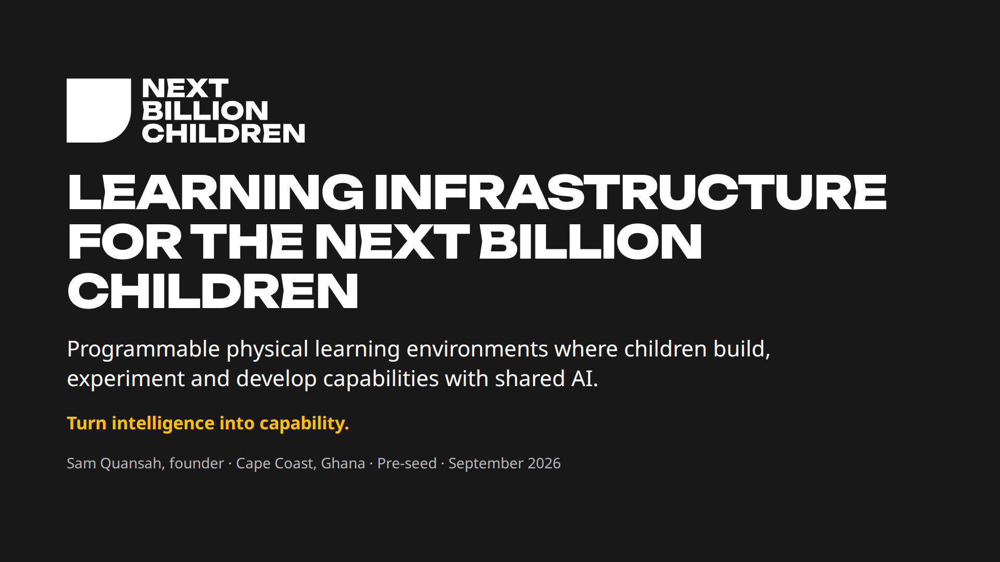
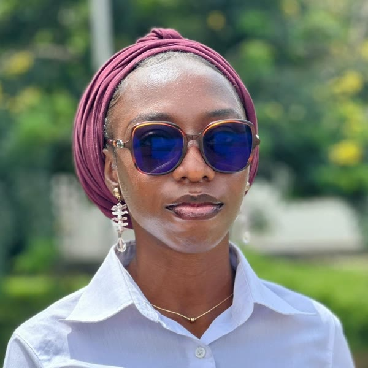

# NBC · Venture Creation Toolkit (VCT)

**Everything we use to build NBC this term: thesis, brand, marketing, research, forecasts, tactics, milestones and deadlines.**

Algo Peers is building NBC: **programmable physical learning environments where children build, experiment and develop capabilities with shared AI.** Founder: Sam Quansah. Base: Cape Coast, Ghana. Term: Fall 2026.

**Our first customers are programme owners:** the people who run after-school clubs, holiday camps and learning centres for children aged about 9–12, starting in Cape Coast.

> **Read this first.** This repository mixes three kinds of material, and each file says which it is:
> - **Sourced:** desk research with links.
> - **Planned:** scripts, drafts, projections and pass lines. These are not results.
> - **Simulated:** rehearsals with fictional personas. These are **never evidence**.
>
> As of 28 Sep 2026, NBC has **no pilots and no revenue**. v1 outreach is **scheduled** for Mon 28 – Tue 29 Sep, and v2 and 10 interviews for Wed 30 Sep – Tue 6 Oct; none is done yet.

## Deadlines now

| Date | Deadline |
|---|---|
| **Tue 29 Sep** | Market research tactic ([deck](weekly-tactics/01-market-research/)) · all 10 v1 messages sent |
| **Wed 7 Oct** | 10 interviews done; which problem and buyer |
| **Tue 13 Oct** | One offer and one bounded learning claim |
| **Tue 20 Oct** | Offers to 10 qualified buyers |
| **Tue 10 Nov** | **Pass line: 3 of 10 buyers pay** |
| **Fri 20 Nov** | Closeout: review every gate |

Full dated plan: [tactics-milestones/DEADLINES.md](tactics-milestones/DEADLINES.md).

## Contents

| Area | Start with | Also |
|---|---|---|
| **Weekly tactics** | [01 Market research tactic (PDF)](weekly-tactics/01-market-research/NBC_Market_Research_Tactic.pdf) | [PPTX](weekly-tactics/01-market-research/NBC_Market_Research_Tactic.pptx) · [what's done and not](weekly-tactics/01-market-research/README.md) |
| **Thesis** | [v5 thesis and strategy](thesis/NBC_Thesis_and_Strategy_v5.md) | [lineage v1–v6](thesis/LINEAGE.md) |
| **Strategy** | [v5 tactical playbook](strategy/NBC_Tactical_Playbook_v5.md) | [reconciliation of v5 with earlier work](strategy/RECONCILIATION.md) |
| **Brand** | [Brand guide (PDF, 14 pages)](brand/NBC_Brand_Guide.pdf) | [brand strategy](brand/BRAND.md) · [logos](brand/logo/) · [tokens](brand/tokens/) |
| **CRM** | [Live PMR CRM (Google Sheets)](https://docs.google.com/spreadsheets/d/11LfHholpkKC0vhpQ7z_DvRme57lPln2jZR7Nm4EMrjg/edit) | [Setup guide and script](marketing/crm/README.md): pipeline, owners, dropdowns, automatic stage updates, activity log, daily reminders |
| **Marketing** | [Marketing strategy](marketing/MARKETING_STRATEGY.md) | [watering holes](marketing/watering_holes_v5.md) · [interview script](marketing/INTERVIEW_SCRIPT.md) · [outreach v1/v2](marketing/OUTREACH_MESSAGES.md) · [tracker and insights grid](marketing/INTERVIEW_TRACKER.md) · [funnel model](marketing/funnel_results.md) |
| **Research** | [Simulated rehearsal (not evidence)](research/simulated/README.md) | |
| **Forecasting** | [Economics, scenarios and forecasts F1–F5](forecasting/ECONOMICS.md) | [benchmarks](forecasting/BENCHMARKS.md) · [projections CSV](forecasting/projections_scenarios.csv) · [partnerships](forecasting/PARTNERSHIPS.md) · [foresight studies](forecasting/README.md) |
| **Tactics and milestones** | [Milestones and pass lines](tactics-milestones/MILESTONES.md) | [deadlines](tactics-milestones/DEADLINES.md) · [weekly decision record](tactics-milestones/WEEKLY_DECISION_RECORD.md) · [24 steps tracker](tactics-milestones/24_STEPS_TRACKER.md) |
| **Program prompt** | [VCT program prompt v3](prompts/VCT_PROGRAM_PROMPT_V3.md) | The operating doctrine these materials follow |
| **Deck** | [NBC deck (PDF)](deck/NBC_Deck.pdf) | |

## Market at a glance

| | Size | Basis |
|---|---|---|
| **TAM** | $29–53B a year | Global after-school programmes, 2025 |
| **SAM** | ~$99M a year | Ghana's ~27,400 basic schools × $3,600 per site |
| **SOM (year 5)** | ~$3.2M a year | 800 sites, central scenario (low $0.36M, high $11.3M) |

## Team

|  |  |  |  |
|---|---|---|---|
| **Sam Quansah** Founder | **Vera Aninakwah** Learning Designer | **Nana Adwoa Nsiah** Learning Experience Designer | **Deborah Quansah** Sales and Marketing Lead |

## How we work
- **We never contact children.** Children take part only through the adults responsible for them, with consent.
- **We don't send children's data to commercial AI models,** and we never sell it.
- **Simulated results are never evidence.** They are used only to sharpen questions.
- **Pass lines are set before we start.** If the data can't answer a question, we record "inconclusive".

---

**Notice.** © 2026 Algo Peers. All rights reserved; see [LICENSE](LICENSE). Plans, projections and pass lines are not results or promises. Technical designs, research data, contact lists and partner documents are not published here.
