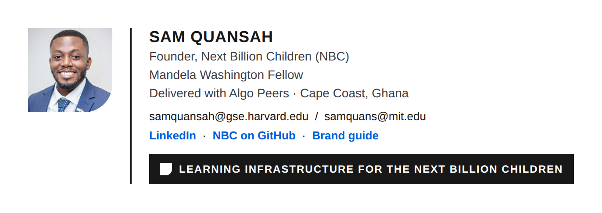

# NBC email signature

**Files:**
- [`email_signature.html`](email_signature.html): the signature, in email-safe HTML (tables and inline styles).
- [`sam-quansah.jpg`](sam-quansah.jpg): the photo.
- [`nbc-symbol-white-28.png`](nbc-symbol-white-28.png): the NBC symbol, as PNG because email clients don't show SVG.

The photo and symbol load from this public repository, so keep the file names unchanged.

## Install in Gmail

1. Open [`email_signature.html`](email_signature.html) and choose **Raw**. Save the file, then open it in Chrome.
2. Select the whole signature (Ctrl/Cmd + A) and copy it.
3. In Gmail, go to **Settings → See all settings → General → Signature → Create new**, and paste.
4. Choose it as the default for new emails and replies, then save.

## Install in Outlook

Go to **Settings → Mail → Compose and reply → Email signature**, then paste the copied signature.

## Rules

These follow the [brand guide](../NBC_Brand_Guide.pdf):
- one colour for the NBC symbol, white on ink;
- the master line, "Learning infrastructure for the next billion children";
- name, role, Mandela Washington Fellow, and both work emails (samquansah@gse.harvard.edu, samquans@mit.edu);
- no phone number or address in the public version.
