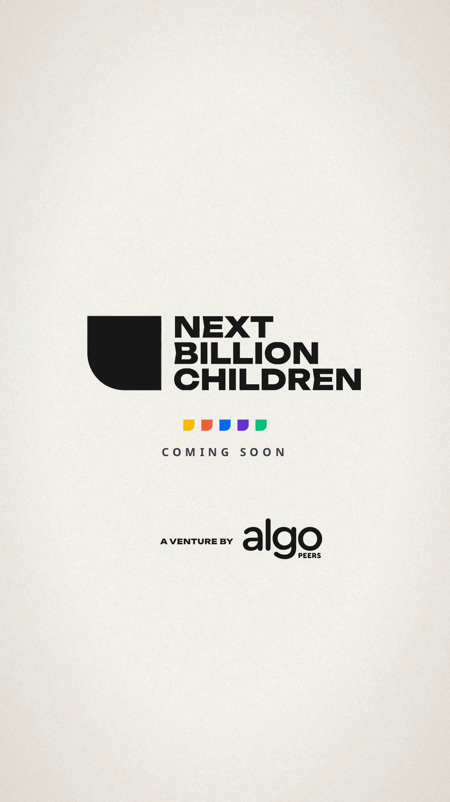

# NBC motion

## Launch film: "Introducing Learning Worlds"

**[NBC_Launch_Film.mp4](NBC_Launch_Film.mp4)** · 86 seconds · 1920 × 1080 · 30 fps · original score, mastered softly to −20 LUFS

The calm, product-launch style of an AI-lab release film: a warm paper canvas, sentence-case type, slow camera push-ins, soft focus pulls and light film grain.

1. "Answers have never been easier to get." · "But learning isn’t the answer. It’s everything that happens before it."
2. A line-drawn ramp: investigate, build, get it wrong, try again.
3. "For most children, the chance to do this is still rare, and still costly."
4. **Introducing Learning Worlds:** the kit, the facilitator card, the assistant and the evidence summary.
5. A phone close-up: the assistant suggests, and the facilitator confirms. "AI that suggests. People who decide."
6. An evidence card: "No scores. Just what they did, and how much help they had."
7. "Built with educators in Cape Coast, Ghana." · "For the next billion." · the logo.

See **Sound** below for the score.

## NBC Story (first cut)

**[NBC_Story.mp4](NBC_Story.mp4)** · 62 seconds · 1920 × 1080 · 30 fps · original score, softened and remastered to −21 LUFS

The elevator pitch, told in nine scenes in the [NBC brand](../NBC_Brand_Guide.pdf):

| Time | Scene |
|---|---|
| 0:00 | A single piece drops into place. "AI makes answers cheap." |
| 0:05 | Answers flood the screen, then fade to grey. "Answers are everywhere." |
| 0:09 | For children, the chance to investigate, build, get it wrong and try again "is still costly." |
| 0:16 | A car rolls down a ramp and stops short. Change one thing (the ramp height), and it rolls farther. "Then explain why." |
| 0:24 | Pieces assemble into a grid and light up. "NBC builds programmable physical learning environments…" |
| 0:31 | Experience + intelligence + evidence → capability. "Turn intelligence into capability." |
| 0:38 | For programme owners: the kit, the facilitator card, the assistant and the evidence summary. "Hands-on learning, ready to run." |
| 0:45 | Cape Coast, Ghana: 5 years of practice and 1,000+ children with Algo Peers. Then pieces spread outward. "For the next billion." |
| 0:51 | The pieces become one piece, and the logo reveals. "Learning infrastructure for the next billion children." Contact details follow. |

**Notes:**
- The ramp distances (142 cm and 187 cm) are illustrative.
- The 5 years and 1,000+ children are Algo Peers figures.
- [`NBC_Story_source.html`](NBC_Story_source.html) is the animation source. Each frame is rendered at an exact time and encoded to MP4.
- **Score:** see **Sound** below.

## Teaser for WhatsApp and Instagram status

**[NBC_Teaser_1080x1920.mp4](NBC_Teaser_1080x1920.mp4)** · 11 seconds · 1080 × 1920 (9:16) · 30 fps · natural original sound · under 16 MB, so it fits WhatsApp's status limit

Abstract by design, so it shares nothing about what NBC builds:
- one piece appears, and eight more join in the brand colours;
- the pieces become one, under the line "Something is taking shape.";
- the last piece lands as the logo symbol, and the wordmark rises in line by line;
- a row of the five brand colours, then "COMING SOON", then "A venture by Algo Peers" in the real Algo Peers wordmark.

## Sound

All three films share one original sound world: natural, hypnotic and quietly futuristic. It is built entirely from physical models in code ([`NBC_sound_engine.py`](NBC_sound_engine.py), cue sheets in [`NBC_scores.py`](NBC_scores.py)). There are no samples and no licensed audio, so NBC owns it outright.

| Element | How it is made | Its role |
|---|---|---|
| Kalimba tines | Modal synthesis (a fundamental plus fast-fading inharmonic overtones), tuned pentatonic | The voice: a quiet nod to West African thumb pianos |
| Harp-lute strings | Karplus-Strong plucked string, in the spirit of Ghana's seperewa | Reflective phrases; a muted string on "get it wrong" |
| Clay-pot drum | A low resonant body with a soft pitch bend | Pulse without a click |
| Water drops | Bubble model (a sine whose pitch rises as it resonates) | Interface taps, landing cards, the "next billion" sparkle |
| Air | Filtered pink noise through a slowly moving band | Breath, space, the car rolling |
| Drone | Detuned waves, a sine sub and a slow-moving low-pass, breathing at about 0.12 Hz | The hypnotic bed |
| Glass | Soft FM shimmer, used sparingly | The future, very quietly |

- **Hypnotic structure:** a three-note kalimba cell against a clay-pot pulse every four steps (3 against 4), over the breathing drone.
- **Space:** a convolution reverb whose highs decay faster than its lows, like a real room.
- **Mastering:**
  - gentle tape warmth, controlled stereo width, and a soft top end, with almost no energy in the harsh 2–5 kHz band;
  - −20 LUFS integrated, peaks around −9 dBFS;
  - mono-safe for phone speakers (left/right correlation 0.8–0.9, under 0.5 dB lost when summed to mono).
