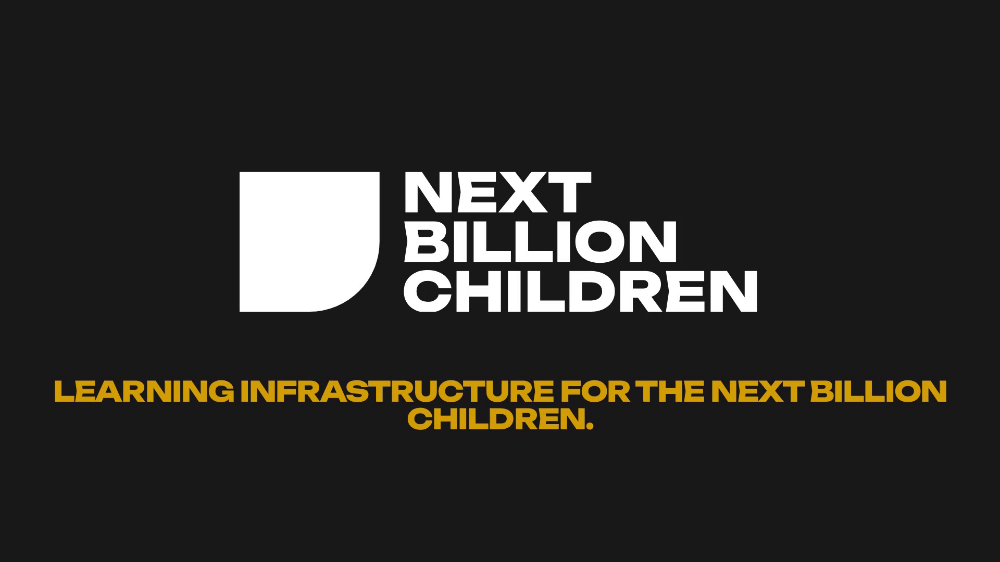

# NBC Story: motion design

**[NBC_Story.mp4](NBC_Story.mp4)** · 62 seconds · 1920 × 1080 · 30 fps · original score, stereo AAC, mastered to −16 LUFS

The elevator pitch, told in nine scenes in the [NBC brand](../NBC_Brand_Guide.pdf):

| Time | Scene |
|---|---|
| 0:00 | A single piece drops into place. "AI makes answers cheap." |
| 0:05 | Answers flood the screen, then fade to grey. "Answers are everywhere." |
| 0:09 | For children, the chance to investigate, build, get it wrong and try again "is still costly." |
| 0:16 | A car rolls down a ramp and stops short. Change one thing (the ramp height), and it rolls farther. "Then explain why." |
| 0:24 | Pieces assemble into a grid and light up. "NBC builds programmable physical learning environments…" |
| 0:31 | Experience + intelligence + evidence → capability. "Turn intelligence into capability." |
| 0:38 | For programme owners: the kit, the facilitator card, the assistant and the evidence summary. "Hands-on learning, ready to run." |
| 0:45 | Cape Coast, Ghana: 5 years of practice and 1,000+ children with Algo Peers. Then pieces spread outward. "For the next billion." |
| 0:51 | The pieces become one piece, and the logo reveals. "Learning infrastructure for the next billion children." Contact details follow. |

**Notes:**
- The ramp distances (142 cm and 187 cm) are illustrative.
- The 5 years and 1,000+ children are Algo Peers figures.
- [`NBC_Story_source.html`](NBC_Story_source.html) is the animation source. Each frame is rendered at an exact time and encoded to MP4.
- **Score:** original, composed in code for this film ([`NBC_Story_score.py`](NBC_Story_score.py)); no samples or licensed audio, so NBC owns it outright.
  - **Key and tempo:** A minor, 96 BPM, resolving to C major on the logo.
  - **Synced hits:** a soft pad and a landing thump as the piece drops; ticks as answers flood in; a marimba note for each of the four words, with a detuned wobble on "get it wrong"; a groove that starts with the ramp, a rolling swoosh for the car and a rising tone as the ramp goes up; a sparkling arpeggio as the grid lights; three chord hits that resolve on "Capability"; a swell for "the next billion"; and a full C major chord as the logo appears.
